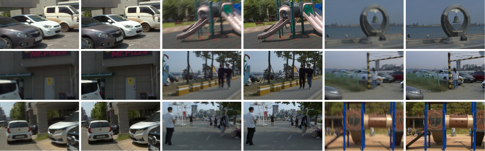
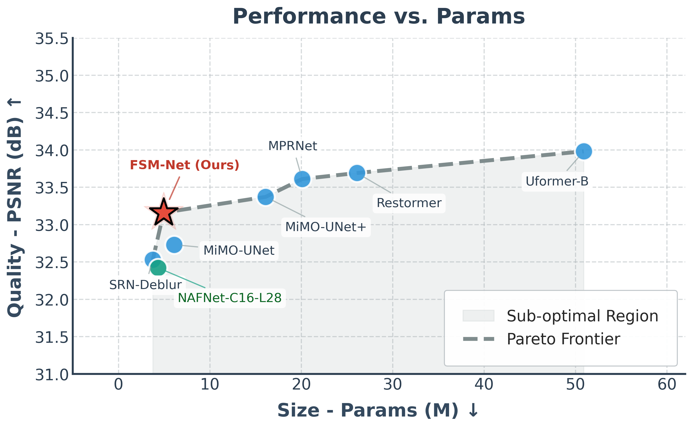

# FSM-Net: An Efficient Frequency-Spatial Network for Real-World Deblurring

[](https://efficient-deblurring-fsmnet.vercel.app/)
[](https://openaccess.thecvf.com/content/CVPR2026W/NTIRE/html/Thuan_FSM-Net_An_Efficient_Frequency-Spatial_Network_for_Real-World_Deblurring_CVPRW_2026_paper.html)

**🏆 2nd place — NTIRE 2026 Challenge on Efficient Real-World Deblurring.**

FSM-Net (Frequency-Spatial Multi-branch Network) is an ultra-lightweight
deblurring model that reaches **33.144 dB PSNR** on the NTIRE 2026 public test
set with only **4.94M parameters** and **159.35 GMACs** at 1920×1200 — well
inside the challenge budget (≤5M params, ≤200 GMACs). It pairs a complex-valued
**Frequency Attention** module (FFT-domain amplitude+phase modulation) with a
**Cross-Gated Vision E-Branchformer** bottleneck for linear-complexity global
context, trained with a progressive curriculum and a composite spatial +
structural + frequency loss.

> Paper: *FSM-Net: An Efficient Frequency-Spatial Network for Real-World
> Deblurring* (CVPR Workshops / NTIRE 2026) —
> [CVF Open Access](https://openaccess.thecvf.com/content/CVPR2026W/NTIRE/html/Thuan_FSM-Net_An_Efficient_Frequency-Spatial_Network_for_Real-World_Deblurring_CVPRW_2026_paper.html).
> Project page: https://efficient-deblurring-fsmnet.vercel.app/

<p align="center">
  
</p>
<p align="center"><em>Blurry input → FSM-Net restoration on the NTIRE 2026 test set.</em></p>

---

## Highlights

- **Dual-domain FSMBlock.** A complex-valued Frequency Attention branch (via
  rFFT / irFFT) recovers high-frequency structure that pure spatial convolutions
  miss, gated against a large-kernel (7×7 depth-wise) spatial branch.
- **Cross-Gated Vision E-Branchformer bottleneck.** A local CNN branch and a
  4-head transposed-attention branch mutually gate each other, giving global
  receptive field at `O(HWC²)` instead of `O(H²W²C)`.
- **Curriculum training + composite loss.** Multi-Scale Charbonnier + Structural
  Edge + Frequency Consistency, with EMA (decay 0.999) for flat-minima stability.
- **Edge-ready.** 4.94M params, sub-second inference (0.069s single pass,
  0.276s with TTA×4 on an RTX 5090).

---

## Architecture

<p align="center">
  
</p>
<p align="center"><em>(a) U-shaped 4-level encoder–decoder built entirely from
FSMBlocks; (b) the Frequency-Spatial Multi-branch Block with complex-valued
Frequency Attention + SCA; (c) the Cross-Gated Vision E-Branchformer bottleneck.</em></p>

The model lives in [`archs/nafnet.py`](archs/nafnet.py):

| Component                     | Class                        | Role                                             |
|-------------------------------|------------------------------|--------------------------------------------------|
| Frequency Attention           | `FrequencyAttention`         | complex-valued FFT filter (amplitude + phase)    |
| Frequency-Spatial block       | `FSMBlock`                   | encoder/decoder unit (FreqAttn + SCA + SimpleGate FFN) |
| Transposed attention          | `TransposedAttention`        | channel-covariance attention, linear complexity  |
| Cross-gated bottleneck        | `VisionEBranchformerBlock`   | local CNN ⊕ global attention with cross-gating    |
| Full network                  | `NAFNet` / `NAFNetLocal`     | U-Net assembling the blocks above (this *is* FSM-Net) |

> Note: the network is registered under the name `NAFNet` in the config for
> backward-compatibility with the challenge baseline framework, but it is the
> FSM-Net architecture described in the paper. The paper configuration is
> `width=16`, `middle_blk_num=2`, `enc_blk_nums=[1,1,1,24]`, `dec_blk_nums=[1,1,1,1]`.

---

## Installation

Tested with CUDA 12.4, Python 3.10, PyTorch ≥ 2.3.1.

```bash
git clone https://github.com/ThuanLy-0092/Efficient-Real-World-Deblurring.git
cd Efficient-Real-World-Deblurring

python -m venv venv_rsblur
source venv_rsblur/bin/activate
pip install -r requirements.txt
```

---

## Dataset

Experiments use the **RSBlur** dataset (official NTIRE 2026 data). Download
`RSBLUR.zip` from the [RSBlur repo](https://github.com/rimchang/RSBlur), and the
train/val/test split lists from its `datalist/RSBlur/` folder.

Place the data under `./data/datasets/` and the split `.txt` files under
`./data/datasets/RSBlur/`. See [`data/README.md`](data/README.md) for the exact
layout the pipeline expects.

> The validation and test sets are for evaluation only — training on them leads
> to disqualification in the challenge.

---

## Usage

All three tasks run through `torchrun` (Distributed Data Parallel), driven by a
YAML config in [`options/`](options/).

### Train

Edit [`options/train/RSBlur.yml`](options/train/RSBlur.yml) (network size, loss
weights, epochs, data path) and the GPU / log path in
[`train.sh`](train.sh), then:

```bash
sh train.sh
```

The framework supports a **multi-step curriculum** via the `STEPS` key (crop
size, resolution, and loss weights per step) — this reproduces the paper's
5-phase 512→1920 schedule. The default single-step config trains at 1200×1920
with Multi-Scale Charbonnier + Edge (L2) + FFT losses.

### Inference

Set the architecture in
[`options/inference/RSBlur.yml`](options/inference/RSBlur.yml), point
[`inference.sh`](inference.sh) at your checkpoint and input folder, then:

```bash
sh inference.sh
```

Deblurred outputs are written to `results/`, named to match their inputs; zip
that folder for challenge submission.

> Keep the network config in the inference YAML identical to the one the
> checkpoint was trained with, or weight loading will silently drop mismatched
> keys.

Checkpoint: https://drive.google.com/drive/folders/14ve1G9QpYtWPhNKR4aY-e6JHuIWNNQ-J?usp=sharing

### Computational cost

Configure [`options/cost/Runtime.yml`](options/cost/Runtime.yml), then:

```bash
sh cost.sh
```

This reports params, GMACs (at 1920×1200), and per-image runtime — use it to
verify the ≤5M / ≤200 GMACs budget.

---

## Results

### NTIRE 2026 Efficient Real-World Deblurring (public test)

| Rank | Team            | PSNR ↑ | SSIM ↑ | Time (s) ↓ |
|------|-----------------|--------|--------|------------|
| 1    | jingjing et al. | 33.390 | 0.8585 | —          |
| **2**| **FSM-Net (ours)** | **33.144** | **0.8516** | **0.276** |
| 3    | weichow         | 32.883 | 0.8467 | —          |
| 4    | licheng         | 32.805 | 0.8473 | —          |

FSM-Net secures 2nd place with a fully reported **sub-second** runtime,
beating the defending 2025 champion by +0.339 dB.

### Cross-dataset benchmark (PSNR / SSIM)

| Method         | Params (M) | RSBlur        | RealBlur-R    | RealBlur-J    | GoPro         |
|----------------|-----------:|---------------|---------------|---------------|---------------|
| MPRNet         | 20.1       | 33.61 / 0.8614 | —            | —            | 30.96 / 0.9390 |
| Restormer      | 26.1       | 33.69 / 0.8628 | —            | —            | 31.22 / 0.9420 |
| Uformer-B      | 50.9       | 33.98 / 0.8660 | —            | —            | 30.83 / 0.9520 |
| **FSM-Net (ours)** | **4.94** | 33.16 / 0.8533 | 36.95 / 0.9585 | 29.45 / 0.8840 | 30.60 / 0.9068 |

RSBlur numbers are a single forward pass (no TTA). Cross-dataset rows use a
5-epoch fine-tune from the RSBlur weights.

### Efficiency frontier

<p align="center">
  
</p>
<p align="center"><em>Quality–efficiency Pareto frontier on RSBlur: FSM-Net
matches heavy transformers at a fraction of the parameter count.</em></p>

### Ablation (20-epoch, 1920×1200)

| Model      | FreqAttn | E-Branch | Params (M) | GMACs  | PSNR ↑ | SSIM ↑ | LPIPS ↓ |
|------------|:--------:|:--------:|-----------:|-------:|--------|--------|---------|
| Baseline   | ✗        | ✗        | 4.35       | 146.33 | 31.39  | 0.8175 | 0.3557  |
| + FreqAttn | ✓        | ✗        | 4.66       | 155.66 | 31.57  | 0.8217 | 0.3494  |
| + E-Branch | ✗        | ✓        | 4.93       | 159.35 | 31.60  | 0.8216 | 0.3478  |
| **FSM-Net**| ✓        | ✓        | 4.94       | 159.35 | **31.83** | **0.8282** | **0.3456** |

The two modules are complementary: their combined gain (+0.44 dB) exceeds the
sum of their individual gains.

---

## Repository layout

```
Efficient-Real-World-Deblurring/
├── archs/
│   ├── nafnet.py            # FSM-Net: FrequencyAttention, FSMBlock, VisionEBranchformerBlock
│   ├── nafnet_utils/        # LayerNorm2d, local-window base, arch helpers
│   └── __init__.py          # model factory, optimizer/scheduler, weight loading
├── data/                    # RSBlur dataset pipeline + download helper
├── losses/                  # Multi-Scale Charbonnier, Edge, FFT losses
├── tools/                   # trainer.py / tester.py (DDP train + eval loops)
├── options/
│   ├── train/RSBlur.yml     # training config (curriculum, losses, network size)
│   ├── inference/RSBlur.yml # inference config
│   └── cost/Runtime.yml     # params / GMACs / runtime config
├── figs/                    # architecture, example, and Pareto figures (README images)
├── train.py / train.sh
├── inference.py / inference.sh
├── computing_cost.py / cost.sh
└── requirements.txt
```

---

## Citation

```bibtex
@InProceedings{Thuan_2026_CVPR,
    author    = {Thuan, Ly},
    title     = {FSM-Net: An Efficient Frequency-Spatial Network for Real-World Deblurring},
    booktitle = {Proceedings of the IEEE/CVF Conference on Computer Vision and Pattern Recognition (CVPR) Workshops},
    month     = {June},
    year      = {2026},
    pages     = {2572-2581}
}
```

## Acknowledgements

Built on the NTIRE 2026 Efficient Real-World Deblurring
[baseline framework](https://github.com/danifei/Efficient-Real-World-Deblurring)
and the original [NAFNet](https://github.com/megvii-research/NAFNet)
implementation. Thanks to the challenge organizers and the RSBlur authors.